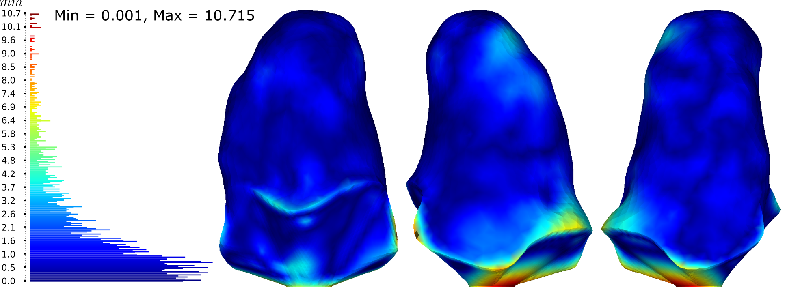

# ARACAM

## A RGB-D Multi-View Photogrammetry System for Lower Limb 3D Reconstruction Applications

## Dependencies:

ARACAM uses different libraries, install dependencies using PyPi. 

```python
pip install nbimporter
pip install opencv-contrib-python
pip install matplotlib
pip install scikit-image
pip install open3d
pip install pandas
pip install pyvista
pip install pymeshfix
pip install pymeshlab
pip install plotly
pip install kaleido
```

## Pipeline

The [main.ipynb](main.ipynb) notebook contains the pipeline of the project and it is structured as follows:

1. [segmentation_color.ipynb](segmentation_color.ipynb) - Selects the desired object by means of depth and color.

2. [to_pointcloud.ipynb](to_pointcloud.ipynb) - Transforms all color and depth pair information into 3D point cloudls.

3. [pointcloud_process.ipynb](pointcloud_process.ipynb) - Reconstructs all poinclouds using ICP algorithm

4. [3D_validation.ipynb](3D_validation.ipynb) - Compares the original mesh obtained from a CT vs the ARACAM


## Model comparisson

<b>Original model obtained from a CT image</b>


<b>Model obtained from the ARACAM system</b>


<b>Hausdorff distances was used compare both models. For this model, everything above the cutline is relevant for the comparisson only.<b>\


## Citing 

If you use the ARACAM work for a scientific purpose, please cite the following paper.

```
@Article{Barreto2022,
	AUTHOR = {Barreto, Marco A. and Perez-Gonzalez, Jorge and Herr, Hugh M. and Huegel, Joel C.},
	TITLE = {ARACAM: A RGB-D Multi-View Photogrammetry System for Lower Limb 3D Reconstruction Applications},
	JOURNAL = {Sensors},
	VOLUME = {22},
	YEAR = {2022},
	NUMBER = {7},
	ARTICLE-NUMBER = {2443},
	URL = {https://www.mdpi.com/1424-8220/22/7/2443},
	PubMedID = {35408058},
	ISSN = {1424-8220},
	DOI = {10.3390/s22072443}
}
```
